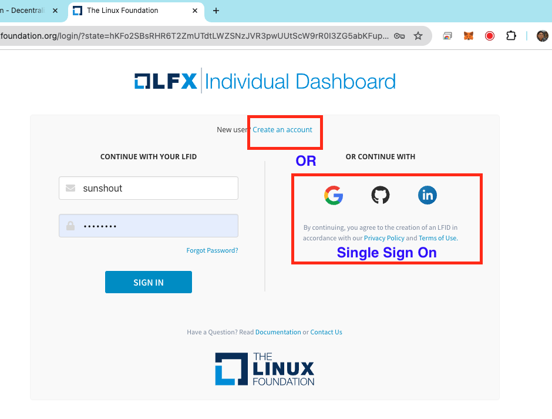
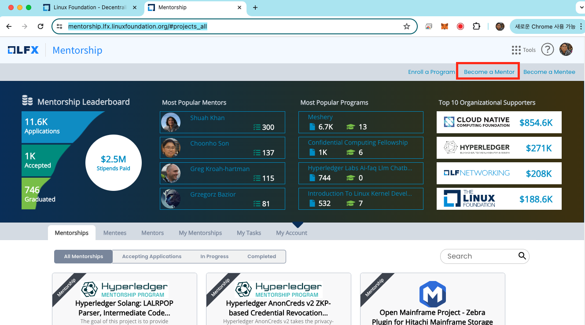

# Join LinuxFoundation

To be a mentor of LFX Mentorship Program, you need to join the Linux Foundation. Please follow the steps below to join the Linux Foundation.

## Step 1. Join the Linux Foundation

1. Go to the [Linux Foundation](https://www.linuxfoundation.org/) website.
2. Click the `Sign In` button on the top right corner.

3. Click the `Create an account` or `Single Sign On` link.

## Step 2. Become a Mentor

1. Go to the [LFX Mentorship Program](https://mentorship.lfx.linuxfoundation.org/) website.
2. Click the `Become a Mentor` button on the top right corner.

