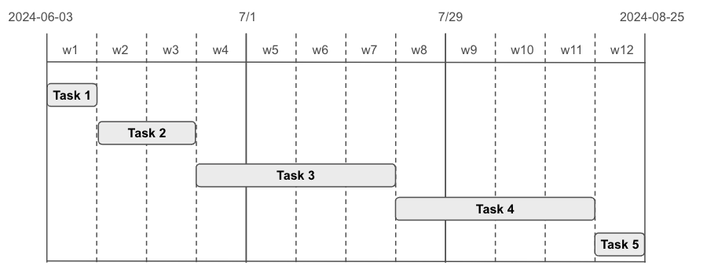

# Mentorship Guide for NHN Cloud support

Cloudforet provides mentorship program in LFX platform.

| Title | Date |
| ---   | ---  |
| Cloudforet NHN cloud Plugin Development - UNPAID 2024 Mentorship program | 2024-06 ~ 2024-08 |

| Task              | Period                  | Agenda       |
|-------------------|-------------------------|-------------------|
| Task #1 (1 week)  | 2024-06-03 ~ 2024-06-09 | Step 1 ~ Step 3  |
| Task #2 (2 weeks) | 2024-06-10 ~ 2024-06-23 | Step 4 ~ Step 6  |
| Task #3 (4 weeks) | 2024-06-24 ~ 2024-07-21 | Step 7 (round #1) |
| Task #4 (4 weeks) | 2024-07-22 ~ 2024-08-18 | Step 7 (round #2) |
| Task #5 (1 weeks) | 2024-08-19 ~ 2024-08-25 | Step 8            |

# Mentorship Agenda

## Cloudforet Plugin Development

## Step 1. Orientation and Fundamentals

* [Introduction to mentorship program](https://mentorship.lfx.linuxfoundation.org/project/450c99f1-edd7-49bc-8a3f-e27c0cd0377d)
* [Survey](https://forms.gle/JkEQNfPXpTJ4G4oS8)
* [Introduction to Cloudforet](https://docs.google.com/presentation/d/1iJvxHBB79xADKaHt2HfjDVSwd1m_COxiURx_M2Vo1uA/edit?usp=sharing)
* [Installation of Cloudforet with minikube](https://cloudforet.io/docs/setup_operation/quick_install/)

## Step 2. Understanding of Cloud Computing & Kubernetes

* Fundamentals of cloud computing and Kubernetes
  * [Kubernetes Overview](https://kubernetes.io/docs/concepts/overview/)
  * [Kubernetes Components](https://kubernetes.io/docs/concepts/overview/components/)
  * [Learn Kubernetes Basics](https://kubernetes.io/docs/tutorials/kubernetes-basics/)
* Introduction to CI/CD (github actions and helm)
  * [An Introduction to Helm](https://youtu.be/Zzwq9FmZdsU)

## Step 3. Undertanding of Protobuf & gRPC

* [Introduction to Protocol Buffers](https://training.linuxfoundation.org/training/introduction-to-protocol-buffers-lfs145/)
* What is gRPC?
  * [What is gRPC? Protocol Buffers, Streaming, and Architecture Explained](https://www.freecodecamp.org/news/what-is-grpc-protocol-buffers-stream-architecture/)
  * [Introduction to gRPC](https://grpc.io/docs/what-is-grpc/introduction/)
  * [Core concepts, architecture and lifecycle](https://grpc.io/docs/what-is-grpc/core-concepts/)
  * [Python/Quick start](https://grpc.io/docs/languages/python/quickstart/)
  * [Python/Basics tutorial](https://grpc.io/docs/languages/python/basics/)

## Step 4. Introduction NHN Cloud

* Overview NHN Cloud

## Step 5. Introduction Cloudforet Architecture

* [Core architecture of Cloudforet](https://cloudforet.io/docs/concepts/architecture/)
* [Inventory Collector](https://cloudforet.io/docs/concepts/inventory/collector/)

## Step 6. Plugin Development Basic

* Design Cloudforet Plugin Skeleton Code
  * [Provider & Service Account](https://cloudforet.io/docs/concepts/identity/provider/)
  * https://github.com/cloudforet-io/plugin-example-inven-collector
  * [Example Provider](https://github.com/cloudforet-io/plugin-example-inven-collector/blob/master/managed_resource/provider/example.yaml)
  * [Example Service Account](https://github.com/cloudforet-io/plugin-example-inven-collector/tree/master/managed_resource/schema)
  * Register Plugin
  * Inventory Collector
* Implement First Resources
  * Server Resources

## Step 7. Plugin Development Advanced

* Debugging and Reporting a real-world plugin
* Code Review and Merge
* Integration Test

## Step 8. Program Evaluation and Wrap-up

* Collecting feedback from interns
* Evaluation of achievements and learnings
* Wrapping up the internship program
* Guidance on next steps

# Mentorship Q&A Channel

[Discord #Mentorship](https://discord.gg/7ExpTmA6TE)
